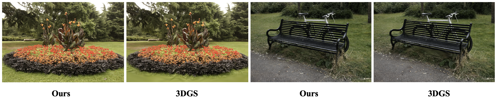

# Floater-Free-Gaussian-Splatting



This repo uses the absolute value of the gradient of pixel pairs for GS to accumulate the gradient of each GS. Since the preprint paper [absGS](https://ty424.github.io/AbsGS.github.io/) did the same thing, therefore, you can also consider this repo as an unofficial implementation of [absGS](https://ty424.github.io/AbsGS.github.io/). 


Compared to [Pixel-GS](https://pixelgs.github.io/), our project can achieve the removal of floaters without significantly increasing the number of GS. In some scenarios where the point cloud distribution is good, it can reduce the number of point clouds. Compared to [Radsplat](https://arxiv.org/abs/2403.13806), our method does not require training zipnerf, and the training time on a 3090 is approximately 30 minutes.

## Dataset

In this project, you can use:

- synthetic dataset from [NeRF](https://drive.google.com/drive/folders/128yBriW1IG_3NJ5Rp7APSTZsJqdJdfc1), and [NSVF](https://dl.fbaipublicfiles.com/nsvf/dataset/Synthetic_NSVF.zip)
- real-world dataset from [Mip-NeRF 360](https://jonbarron.info/mipnerf360/) and [tandt_db](https://repo-sam.inria.fr/fungraph/3d-gaussian-splatting/datasets/input/tandt_db.zip).

And the data structure should be organized as follows:

```shell
data/
├── NeRF
│   ├── Chair/
│   ├── Drums/
│   ├── ...
├── NSVF
│   ├── Bike/
│   ├── Lifestyle/
│   ├── ...
├── Mip-360
│   ├── bicycle/
│   ├── bonsai/
│   ├── ...
├── tandt_db
│   ├── db/
│   │   ├── drjohnson/
│   │   ├── playroom/
│   ├── tandt/
│   │   ├── train/
│   │   ├── truck/
```


## Run

### Environment

```shell
git clone https://github.com/ingra14m/floater-free-gaussian-splatting --recursive
cd floater-free-gaussian-splatting

conda create -n abs-gaussian-env python=3.8
conda activate abs-gaussian-env

# install pytorch
pip install torch==1.13.1+cu116 torchvision==0.14.1+cu116 --extra-index-url https://download.pytorch.org/whl/cu116

# install dependencies
pip install -r requirements.txt
```


### Train

```shell
python train.py -s your/path/to/the/dataset -m your/path/to/save --eval

# Mip-360
python train.py -s your/path/to/the/dataset -m your/path/to/save --eval -r [2/4]

# Others
python train.py -s your/path/to/the/dataset -m your/path/to/save --eval
```

It should be noted that we adopted the same approach as ZipNeRF, Pixel-GS, and RadSplat, downsampling outdoor scenes (`bicycle`, `garden`, `stump`, `flower`, `treehill`) by 4 times and indoor scenes (`bonsai`, `counter`, `kitchen`, `room`) by 2 times. 


### Render

```shell
python render.py -m your/path/to/save --eval --skip_train
```


### Render Video

```shell
python render.py -m your/path/to/save --eval --skip_train --skip_test --render_video
```


### Metrics

```
python metrics.py -m your/path/to/save
```


## Results

### Mip360

| Scene    | PSNR  | SSIM   | LPIPS  | Mem  | FPS  |
| -------- | ----- | ------ | ------ | ---- | ---- |
| bicycle  | 25.82 | 0.7989 | 0.1656 | 1441 | 66   |
| bonsai   | 32.41 | 0.9502 | 0.1608 | 258  | 170  |
| counter  | 29.22 | 0.9187 | 0.1687 | 261  | 125  |
| garden   | 27.95 | 0.8799 | 0.0934 | 971  | 65   |
| kitchen  | 31.91 | 0.9351 | 0.1081 | 434  | 99   |
| room     | 31.78 | 0.9331 | 0.1750 | 416  | 114  |
| stump    | 27.3  | 0.7976 | 0.1848 | 1043 | 103  |
| flower   | 21.84 | 0.6495 | 0.2629 | 888  | 105  |
| treehill | 22.39 | 0.6475 | 0.2697 | 1087 | 87   |
| Average  | 27.85 | 0.8345 | 0.1765 | 755  | 104  |

https://github.com/ingra14m/robust-gaussian-splatting/assets/63096187/e0f34e5f-ee83-442b-86fc-422c57c40a6b

https://github.com/ingra14m/floater-free-gaussian-splatting/assets/63096187/52d99636-cc9c-4b57-aaf1-651759e7e4c7


### NeRF

| Scene     | PSNR  | SSIM   | LPIPS  | Mem  | FPS  |
| --------- | ----- | ------ | ------ | ---- | ---- |
| chair     | 35.69 | 0.9879 | 0.0103 | 101  | 219  |
| drums     | 26.33 | 0.955  | 0.0363 | 74   | 300  |
| ficus     | 35.54 | 0.987  | 0.0117 | 48   | 386  |
| hotdog    | 38.17 | 0.9857 | 0.0185 | 44   | 331  |
| lego      | 36.4  | 0.9833 | 0.0148 | 61   | 317  |
| materials | 30.61 | 0.961  | 0.0357 | 33   | 444  |
| mic       | 36.73 | 0.9926 | 0.0063 | 39   | 307  |
| ship      | 31.85 | 0.9061 | 0.0998 | 89   | 212  |
| Average   | 33.92 | 0.9698 | 0.0292 | 61   | 315  |

## Methods

```c++
// vanilla gradients for densification
atomicAdd(&dL_dmean2D[global_id].x, dL_dG * dG_ddelx * ddelx_dx);
atomicAdd(&dL_dmean2D[global_id].y, dL_dG * dG_ddely * ddely_dy);

// abs gradients for densification
atomicAdd(&dL_dmean2D_densify[global_id].x, fabsf(dL_dG * dG_ddelx * ddelx_dx));
atomicAdd(&dL_dmean2D_densify[global_id].y, fabsf(dL_dG * dG_ddely * ddely_dy));
```


## BibTex

This idea is the same as [absGS](https://arxiv.org/abs/2404.10484) and [Gaussian Opacity Fields](https://arxiv.org/abs/2404.10772). The difference is that we have set the `densify_grad_threshold` to 0.0005, and all other parameters are used as in vanilla 3D-GS. If you find this project useful, please don't forget to cite these two awesome papers. 

```shell
@article{ye2024absgs,
  title={AbsGS: Recovering Fine Details for 3D Gaussian Splatting},
  author={Ye, Zongxin and Li, Wenyu and Liu, Sidun and Qiao, Peng and Dou, Yong},
  journal={arXiv preprint arXiv:2404.10484},
  year={2024}
}

@article{Yu2024GOF,
  author    = {Yu, Zehao and Sattler, Torsten and Geiger, Andreas},
  title     = {Gaussian Opacity Fields: Efficient High-quality Compact Surface Reconstruction in Unbounded Scenes},
  journal   = {arXiv:2404.10772},
  year      = {2024},
}
```
